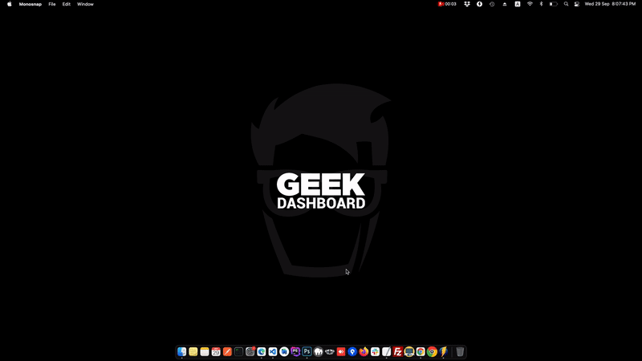
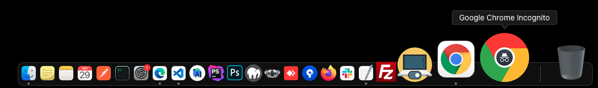

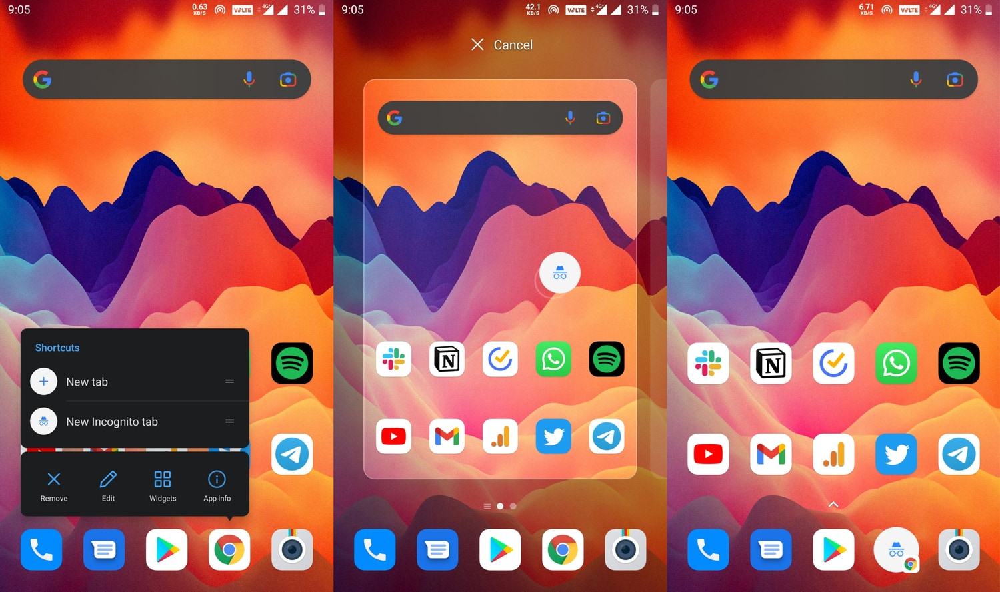
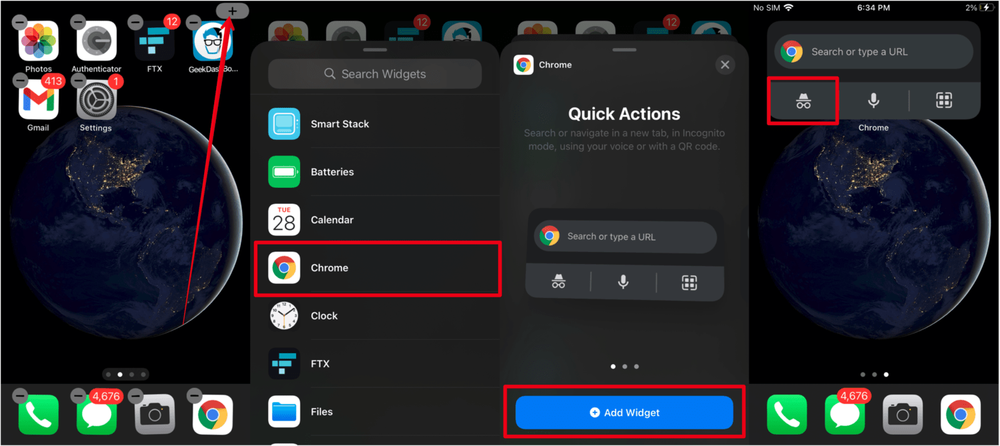

# Always Launch Google Chrome in Incognito Mode


Privacy is what we all need in this internet era and Incognito Mode (Private browsing) on Google Chrome partially helps in achieving it.

Here is how you can by default open Google Chrome in Incognito mode on Mac, Windows, Linux, Android, iOS and iPadOS.

- <a href="#macOS">macOS</a>
- <a href="#windows">Windows</a>
- <a href="#linux">Linux</a>
- <a href="#android">Android</a>
- <a href="#ios-and-ipados">iOS</a>
- <a href="#ios-and-ipados">iPadOS</a>

For more information and detailed blog post, <a href="https://www.geekdashboard.com/how-to-always-launch-google-chrome-in-incognito-mode/">visit How to Always Launch Google Chrome in Incognito Mode on Geek Dashboard</a>

## macOS



Achieving this behavior is simple on Windows, Linux, Android, and iOS. 

However, in macOS, we need to make use of the Automator app and a simple <a href="scripts/automator_script.sh">shell script</a> for the same.

I have made a simple Automator app for macOS named **Google Chome Incognito** to make things easier.

<a href="https://github.com/amarilindra/Always_Google_Chrome_Incognito/raw/main/app/Google%20Chrome%20Incognito.zip"></a>

To use this Automator app, click on the above button and download **Google Chrome Incognito.zip** file to your device. Extract it and you find the **Google Chrome Incognito**

Replace the old Chrome icon with the Google Chrome Incognito you just downloaded. Clicking on it always launches Google Chrome in Incognito mode.




**Shell Script used in Automator app**

```sh
GOOGLE_CHROME="Google Chrome"
GOOGLE_CHROME_APP_PATH="$(dirname "$(dirname "$0" | sed -e "s%/Contents/Resources$%%")")"
GOOGLE_CHROME_APP_NAME="$(basename "$(dirname "$0" | sed -e "s%/Contents/Resources$%%")" | sed -e "s/\.app$//")"
GOOGLE_CHROME_PATH="$(mdfind 'kMDItemContentType == "com.apple.application-bundle" && kMDItemFSName = "'"$GOOGLE_CHROME.app"'"' | head -1)"

if [ -z "$GOOGLE_CHROME_PATH" ]; then
    GOOGLE_CHROME_PATH="$GOOGLE_CHROME_APP_PATH/$GOOGLE_CHROME.app"
fi


if [ -e "$GOOGLE_CHROME_PATH" ]; then
    if [ $(ps -u $(id -u) | grep -c "$GOOGLE_CHROME_PATH/Contents/MacOS/Google Chrome") -gt 1 ]; then
        osascript -e 'tell application "'"$GOOGLE_CHROME"'"' \
                  -e '  set IncogWin to make new window with properties {mode:"incognito"}' \
                  -e '  set URL of active tab of IncogWin to "chrome://newtab"' \
                  -e 'end tell'
    else
        open -n "$GOOGLE_CHROME_PATH" --args --incognito --new-window "chome//:newtab"
    fi

    osascript -e 'tell application "'"$GOOGLE_CHROME"'" to activate'
fi

exit 0
```

**Alternative Script**
```sh
/Applications/Google\ Chrome.app/Contents/MacOS/Google\ Chrome --incognito
```
**Credit:** <a href="https://apple.stackexchange.com/a/68882/233377">Adrian Zaugg</a>

## Windows

1. Open **Start Menu** and search **Google Chrome**
1. Right click on Google Chrome and select **Properties**
1. Click on **Shortcut** tab
1. Added space and append `-incognito` in the **Tagret** field.
1. Click **Apply** and then **Okay**

**Before:** `C:\Program Files (x86)\Google\Chrome\Application\chrome.exe.”`

**After:** `C:\Program Files (x86)\Google\Chrome\Application\chrome.exe.” -incognito`



## Linux

1. Right click on **Google Chrome** icon
1. Select **Properties**
1. Click on **Basic** tab
1. Added space and append `-incognito` in the **Command** field.
1. Click **Close** to save changes.


## Android

1. **Long Press** Google Chrome icon on home screen
1. From **Qick Shortcuts**, drag and drop **New Incognito tab** to your home screen to create a Incognito shortcut.
1. Replace actual **Google Chrome**  icon with above shortcut.




## iOS and iPadOS

1. Tap and hold on empty space of your home screen.
1. Select **+** icon on top right.
1. Scroll down and select **Google Chrome**
1. Add **Google Chrome Quick Actions** widget to your home screen.
1. Tap on **Incognito Search** to open launch incognito window.

